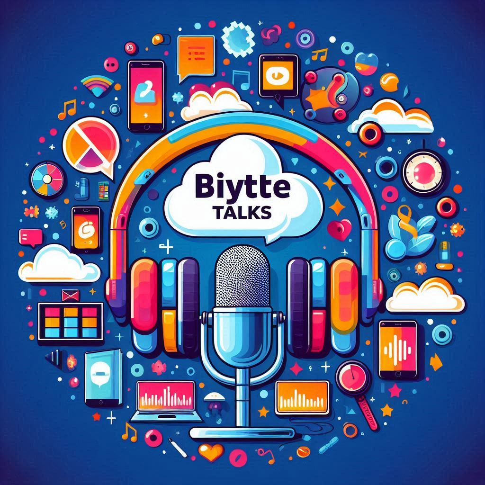

<h1>Byte Talks - Um passeio nos bytes do Desenvolvimento Web</h1>
<h3>Epsódio I: "Aranhaverso Ágil: Teias do Scrum e Kanban"</h3>

    preview do podcast Ep-01

    <audio src="output/audio_editado_ep1.MP3" controls title="Podcast editado"></audio>
    
/output/audio_editado_pe1.mp3

# Projeto Podcast Gerado por I.A.s

Projeto com o objetivo de gerar um podcast utilizando ferramentas de IA através de prompts mais trabalhado.

Utilizer uma esteira de prompts para gerar cada etapa do processo criativo.

## 💻 Tecnologias utilizadas no projeto

- [ChatGPT](https://chat.openai.com/) 
- [Copilolt](https://copilot.microsoft.com//)
- [ElevenLabs](https://beta.elevenlabs.io/)
- [Capcut](https://www.capcut.com/pt-br/)

## ✨ Como foi feito ?

- Nome do PodCas, Titulo do Episódio e Conteúdo gerado via chatgpt

ChatGPT：

|   Ação   | prompt |
| :------: | ------------------------------------------------------------------------------------------------------------------------------------------------------------------------------------------------------------------------------------------------------------------------------ |
|  nome podcast  | Você é um roteirista de podcast, e vamos criar um podcast de tecnologia, focado em desenolvimento de aplicações web. Preciso de 5 sugestões de nomes criativos para esse podcast. O podcast vai falar sobre dicas e novidades sobre o mundo do desenvolvimento e o que está acontecendo no mercado {REGRAS} O nome deve ser enxuto. O nome deve conter alguma palavra forte que remeta ao uso de computadores e seja nerd |
|  título  | Crie um título de um podcast sobre Desenvolvimento Ágil: Aborde metodologias ágeis, como Scrum e Kanban, e como elas melhoram a eficiência do desenvolvimento, o título deve ser épico e curto, e tenha uma temática de homem aranha no aranhaverso, me liste 5 variações de títulos                                                       |
| conteúdo | Você é um roteirista de podcast, e vamos criar um  roteiro de um podcast de tecnologia, focado em desenvolvimento de aplicações web cujo o nome é "Byte Talks",  com o público alvo de iniciantes em desenvolvimento web. O formato do roteiro deve ser [INTRODUÇÃO][CURIOSIDADE 1][CURIOSIDADE 2][FINALIZAÇÃO] {REGRAS}- no bloco [INTRODUÇÃO] substitua por uma introdução iguais as introduções dos vídeos do canal 'ei byte' e introduza o conceito de Desenvolvimento Ágil - no bloco [CURIOSIDADE 1] substitua por uma curiosidade do Scrum aplicao do desenolvimento web - no bloco [CURIOSIDADE 2] descreve sobre a possibilidade usar Kanban e como poderia ser util - no bloco [FINALIZAÇÃO] substitua por uma despedida cool com o final 'Eu sou Carlos Cavalheiro e esse foi o Bytes e Talks dessa semana' - use termos de fácil explicação - O podcast vai ser apresentado somente por uma pessoa, chamada Carlos Cavalheiro - O podcast deve ser curto {REGRAS NEGATIVAS} - Não use muitos termos técnicos - Não ultrapasse 5 minutos de duração |

- Audio gerado pela elevenLabs
- Copilot Para gerar capa/logo

Copilot:

|   Ação   | prompt |
| :------: | ------------------------------------------------------------------------------------------------------------------------------------------------------------------------------------------------------------------------------------------------------------------------------ |
|  capa podcast  | Crie uma imagem de capa para esse pod cast: “Byte Talks” é um pod cast que atua com discussões curtas e envolventes sobre tópicos como segurança cibernética, IA, design de UX e muito mais, seu publico gosta de games e tecnologias. |

- Capcut para tratar aúdio e adicionar sons de fundo

## 👨‍💻 Desenvolvimento

    
    
&nbsp&nbsp&nbsp Carlos Alexandre Cavalheiro 
    &nbsp&nbsp&nbsp
    <a 
        href="https://github.com/CarlosCavalheiro">
        GitHub
    </a>
    &nbsp;|&nbsp;
    <a 
        href="https://www.linkedin.com/in/cavalheiro-ca/">
        LinkedIn
    </a>

  

